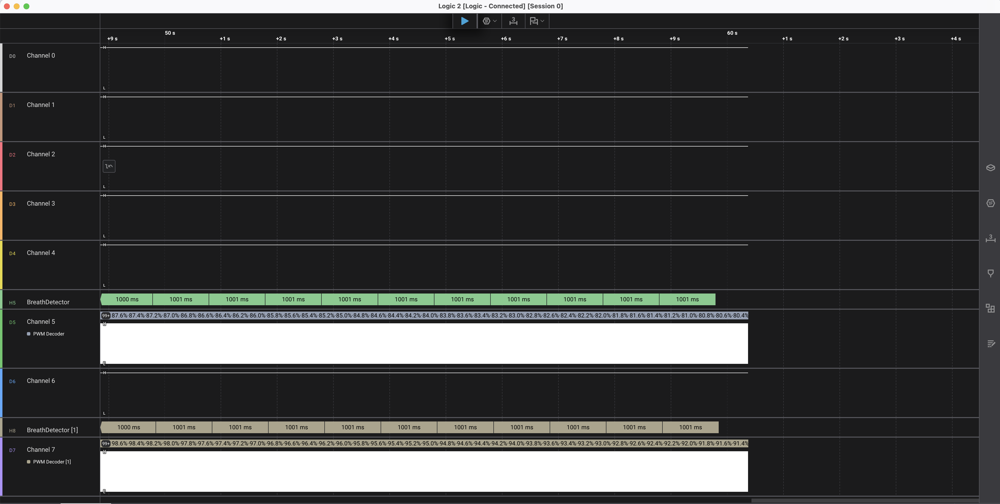

# PWM Breath Analyzer

Saleae Logic 2 extension for detecting LED breathing patterns over PWM.





```
Digital Channel
      ↓
[C++ LLA: PWM Decoder]      → frames {pulse_width, period} via FrameV2
      ↓
[Python HLA: Breath Detector] → alternating breath_high / breath_low frames
```

---

## Build — C++ PWM Decoder

### 1. Clone with submodule

```bash
git clone --recurse-submodules https://github.com/su-mt/pwm-breath-logic-analyzer
git submodule update --init
```

The submodule points to https://github.com/saleae/AnalyzerSDK

### 2. Build

```bash
mkdir build && cd build
cmake ..
cmake --build . --config Release
```

Output:
- Windows: `build/Release/PWMAnalyzer.dll`
- macOS:   `build/libPWMAnalyzer.dylib`
- Linux:   `build/libPWMAnalyzer.so`

### 3. Load in Logic 2

`Preferences → Custom Low Level Analyzers → Add` → select the built library file.

---

## Install — Python HLA

`Extensions → Load Extension` → select the `python_hla/` folder.

---

## Usage in Logic 2

1. Add **PWM Decoder** analyzer on your PWM channel.
2. Add **Breath Detector** analyzer, stacked on top of PWM Decoder.
3. The Breath Detector track will toggle a frame edge every detected breath period.

---

## Thresholds (in breath_detector.py)

| Constant | Default | Meaning |
|---|---|---|
| `DUTY_ZERO_THRESHOLD` | 0.05 % | Below this → duty = 0 |
| `DUTY_PEAK_THRESHOLD` | 99.5 % | Above this → duty = 100 |
| `TIMEOUT_SECONDS` | 4.0 s | Gap before state machine reset |
